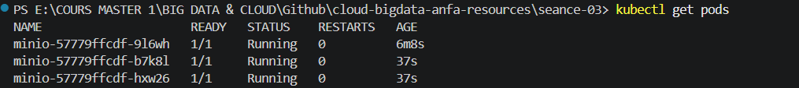

# Rendu Séance 3
**Nom et prénom :** ADJAVOU Efoévi Igor Jonas
**Identifiant GitHub :** https://github.com/JonasAdjavou)
**Date de soumission :** 26/06/2026
## Résumé de la séance
<2-4 lignes : Kind installé, cluster Kubernetes créé, namespace anfa configuré, MinIO déployé via 3 manifestes YAML, self-healing observé, scaling testé, Ingress Controller activé.>
## Étapes principales
1. Installation de Kind et kubectl, création du cluster `anfa`.
2. Création du namespace `anfa` et configuration de kubectl.
3. Déploiement de MinIO via 3 manifestes YAML (PVC, Deployment, Service).
4. Observation du self-healing après suppression manuelle d'un pod.
5. Scaling du Deployment de 1 à 3 replicas, puis retour à 1.
6. Activation de l'Ingress Controller nginx.
## Captures d'écran
### Console MinIO accessible via port-forward

### Self-healing observé

### Scaling à 3 replicas

## Réponses aux exercices d'application
Exercices d'application – Séance 3
Exercice 1 – QCM conceptuel
1.1  →  B  — Kubernetes remplace Docker comme moteur de conteneurs via CRI-O
1.2  →  B  — etcd stocke l'état complet du cluster
1.3  →  C  — le Scheduler décide sur quel nœud placer un pod
1.4  →  C  — kubectl parle à l'API Server
1.5  →  B  — le Deployment recrée immédiatement un nouveau pod
1.6  →  B  — NodePort expose depuis l'extérieur sans load balancer cloud
1.7  →  B  — elle modifie l'état souhaité à 5 replicas ; Kubernetes converge
1.8  →  B  — un Namespace isole logiquement les ressources
1.9  →  A  — Kind crée des nœuds Kubernetes sous forme de conteneurs Docker
Exercice 2 – Lecture de manifeste
2.1  Le champ selector.matchLabels lie le Deployment aux pods portant le label app: anfa-api défini dans template.metadata.labels.
2.2  2 pods (replicas: 2).
2.3  http://minio:9000 est un nom DNS interne au cluster résolu par kube-dns — pas une IP externe.
2.4  L'API est inaccessible depuis l'extérieur : aucun Service n'expose le port 8000.
2.5  Service à créer :
apiVersion: v1
kind: Service
metadata:
  name: anfa-api
spec:
  selector:
    app: anfa-api
  ports:
    - port: 80
      targetPort: 8000
Exercice 3 – Diagnostic
3.1 – Le pod qui ne démarre pas
a.  ImagePullBackOff = Kubernetes n'arrive pas à télécharger l'image.
b.  Image introuvable sur le registry (nom/tag erroné ou registry privé non authentifié).
c.  kubectl describe pod <nom>
3.2 – Le PVC qui ne se lie pas
a.  Pending = aucun PersistentVolume disponible pour satisfaire la PVC.
b.  kubectl get storageclass (vérifier qu'un provisionneur existe).
c.  Aucun StorageClass avec provisionneur automatique dans Kind — il faut installer local-path-provisioner.
3.3 – Le port-forward qui échoue
a.  Le pod n'est pas Running, donc pas de port à forwarder.
b.  Corriger d'abord l'erreur du pod (image ou PVC).
c.  Ordre logique : corriger pod → attendre Running → lancer port-forward.
Exercice 4 – Docker Compose → Kubernetes
4.1  3 manifestes nécessaires : Deployment, Service NodePort, PersistentVolumeClaim.
4.2  En Compose, volumes: - minio-data:/data = volume nommé géré par Docker. En Kubernetes : une PVC réclame le stockage et le Deployment le monte via volumeMounts → découplage explicite stockage/application.
4.3  Compose mappe directement sur un port de l'hôte (ports: 9001:9001). Avec Kind, le NodePort est exposé sur le nœud conteneur, pas sur localhost de la machine — d'où le recours à port-forward.
4.4  Deux apports concrets de Kubernetes vs Compose :
•	Résilience : pod recréé automatiquement si crash.
•	Scalabilité déclarative : kubectl scale sans toucher au fichier.
Exercice 5 – Mini-cas architecture
5.1  Types d'objets Kubernetes :
•	pipeline-anfa → CronJob (tâche planifiée nocturne)
•	anfa-api → Deployment (service REST stateless, toujours disponible)
•	anfa-dashboard → StatefulSet (Grafana avec état persistant)
5.2  Paramètres HPA pour anfa-api :
minReplicas: 2
maxReplicas: 10
metric: cpu
targetAverageUtilization: 60
5.3  ClusterIP — l'API est consommée uniquement en interne par le pipeline et le dashboard.
5.4  Une mise à jour de anfa-api provoque un rolling update : Kubernetes remplace les pods un par un → zéro coupure de service.
5.5  Squelette de manifeste Deployment pour anfa-api :
apiVersion: apps/v1
kind: Deployment
metadata:
  name: anfa-api
spec:
  replicas: 3
  selector:
    matchLabels:
      app: anfa-api
  template:
    metadata:
      labels:
        app: anfa-api
    spec:
      containers:
        - name: api
          image: anfa/api:v1
          ports:
            - containerPort: 9000
          env:
            - name: MINIO_ENDPOINT
              value: "http://minio:9000"

## Difficultés rencontrées
<Aucune | Décrivez brièvement.>