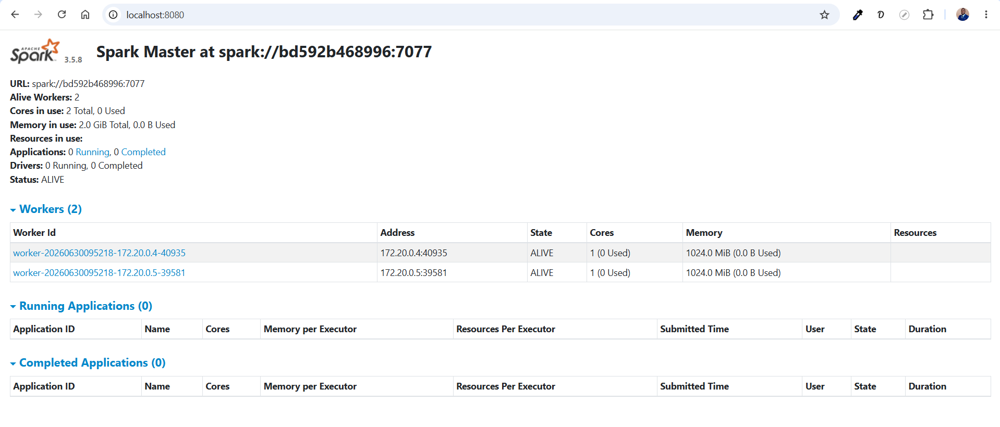
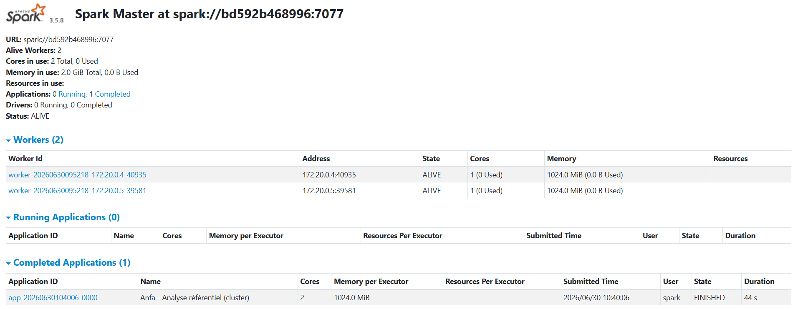
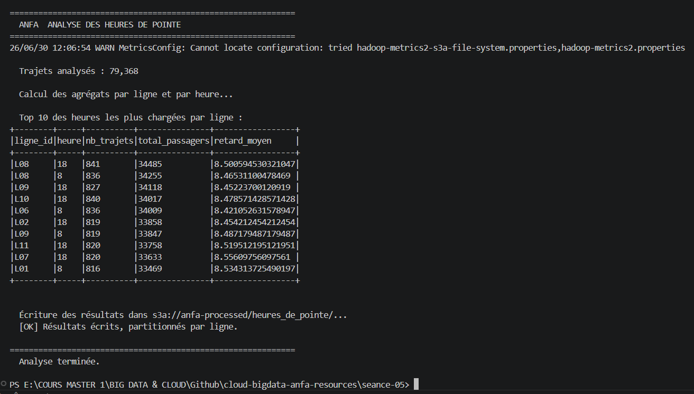
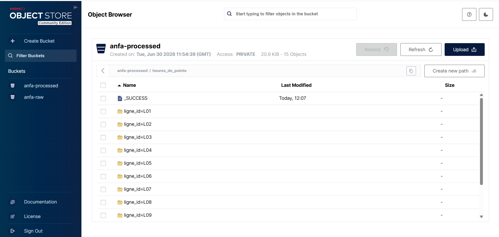

# Rendu Séance 5
**Nom et prénom :** ADJAVOU Efoévi Igoe Jonas
## Résumé de la séance
<2-4 lignes : cluster Spark déployé via Compose, jobs PySpark distribués exécutés, données lues depuis MinIO et résultats écrits en Parquet, comparaison local vs cluster.>
## Étapes principales
1. Déploiement du cluster Spark standalone (1 master + 2 workers) via Docker Compose.
2. Préparation de MinIO et upload du référentiel.
3. Premier job distribué (`analyse_referentiel_cluster.py`) : statistiques de base.
4. Génération d'un historique simulé de trajets et job d'analyse des heures de pointe.
5. Comparaison subjective entre mode local et mode cluster.
## Captures d'écran
### Dashboard Spark Master avec 2 workers

### Application Spark exécutée avec succès

### Résultats du Top 10 dans la console

### Bucket anfa-processed avec heures_de_pointe partitionné

## Réflexion : local vs cluster
Mode local, je l'utiliserais systématiquement en phase de développement et debug : écrire la logique de transformation, tester sur un échantillon, vérifier que le code compile et tourne sans erreur logique. Aussi utile pour l'apprentissage ou des analyses ponctuelles sur un petit dataset qui tient en mémoire sur une machine (pas besoin de mobiliser un cluster pour quelques centaines de Mo de données).

Mode serveur/cluster, je l'utiliserais dès que le volume de données dépasse la capacité d'une seule machine, ou dès que le job doit tourner en prod de façon fiable (tolérance aux pannes nécessaire, traitement nocturne critique, gros ETL sur tes tables Oracle bancaires par exemple). Aussi indispensable avant toute mise en production, même pour valider un job qui semblait fonctionner en local (pour détecter les bugs liés à la sérialisation ou à la distribution avant qu'ils ne posent problème en prod).
## Bonus Spark sur Kubernetes
<Réalisé : non.>
## Réponses aux exercices d'application
<À compléter d'après les énoncés fournis avec l'assignment.>
## Difficultés rencontrées
<Aucune | Décrivez brièvement.>